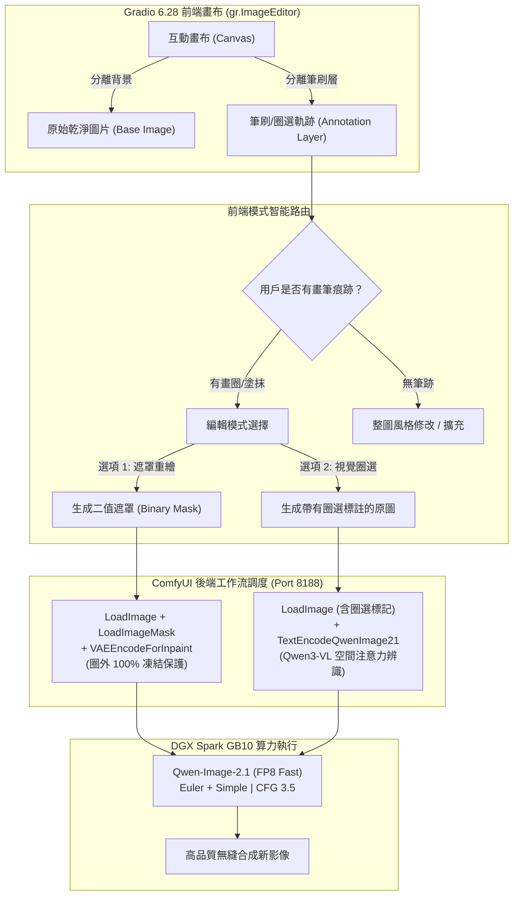

# 🎨 Qwen-Image-2.1 前端互動編輯升級計畫書 (DGX Spark)

根據阿里官方 **Qwen-Image-2.1** 開源技術規範（Single-Stream MMDiT、Qwen3-VL 視覺空間感知）以及 ComfyUI 核心實作，本計畫旨在將目前 DGX Spark 上的 Gradio 前端升級為具備**「畫圈替換（Circle Edit）」**與**「精準遮罩重繪（Mask Inpaint）」**的現代化生成與編輯平台。

---

## 📌 一、現狀分析與升級目標

### 1. 現狀痛點
- **目前前端組件**：採用一般的 `gr.Image` 上傳框，僅支援整張圖片作為參考。
- **編輯方式限制**：只能透過全圖去噪（Denoise 0.6），容易導致背景或非目標物體產生細微形變，無法達到展示影片中「隨手畫圈、精準替換圈內物件、其餘區域 100% 凍結」的流暢體驗。

### 2. 升級目標
根據官方 GitHub 定義之 **"specify local edits via circles, painted annotations, or separate masks"**，在前端實現三種編輯能力：
1. **模式 A：畫圈/彩筆視覺引導替換（Circle & Visual Annotation Edit）**
   - 允許用戶在原圖上直接畫一個彩色圈（如紅圈），由底層 **Qwen3-VL** 多模態模型自動辨識圈內空間座標與主體，提示詞引導重塑目標。
2. **模式 B：遮罩局部精準重繪（Mask Inpainting Mode）**
   - 用戶以筆刷塗抹欲替換區域，系統自動分離出 Mask 遮罩，透過 `VAEEncodeForInpaint` 節點強制將圈外像素 100% 凍結，僅對遮罩內部進行去噪替換與無縫邊緣羽化。
3. **模式 C：多圖參考風格與主體遷移（Multi-Reference Composition）**
   - 支援同時上傳參考圖（例如 `<image1>` 為人物、`<image2>` 為衣服/配飾），進行跨圖物件穿戴與合成。

---

## 🏗️ 二、架構與技術設計



---

## 📋 三、詳細實作計畫與代碼改動

### 步驟 1：前端組件升級（採用 `gr.ImageEditor`）
將原本的單純圖片上傳組件替換為支援圖層與筆刷的編輯器：
```python
# 原本：
# init_image = gr.Image(label="請上傳欲修改的原圖", type="pil")

# 升級為 Gradio 6 現代畫布：
init_image = gr.ImageEditor(
    label="🎨 原圖與互動圈選畫布 (可用畫筆圈選或塗抹要修改的物體)",
    type="pil",
    layers=False,          # 簡化操作，直接在畫布上塗抹
    canvas_size=(1024, 1024),
    brush=gr.Brush(colors=["#ff0000", "#00ff00", "#0000ff", "#ffffff"], default_color="#ff0000", default_size=15),
    eraser=gr.Eraser()
)
```

### 步驟 2：後端傳輸與遮罩自動萃取
在 `upload_image_to_comfy` 中擴展支援：
1. 從 `gr.ImageEditor` 的回傳字典中提取：
   - `background`: 原圖（未標註）。
   - `composite`: 帶有用戶手繪圈圈/塗抹的合成圖。
   - `layers`: 獨立筆刷遮罩圖層。
2. 若使用者啟用「遮罩局部替換（Inpaint）」，將筆刷圖層轉為高對比 Alpha 遮罩並上傳至 ComfyUI。
3. 若使用者啟用「視覺圈選引導（Circle Grounding）」，將 `composite`（帶紅圈的圖）直接送入 Qwen-VL 作為提示影像。

### 步驟 3：ComfyUI 工作流動態組裝
針對不同操作模式組裝對應的 Prompt JSON：
- **遮罩重繪模式**：
  ```json
  "10": { "class_type": "LoadImage", "inputs": { "image": "base_image.png" } },
  "11": { "class_type": "LoadImageMask", "inputs": { "image": "mask_image.png", "channel": "alpha" } },
  "12": { "class_type": "VAEEncodeForInpaint", "inputs": { "pixels": ["10", 0], "vae": ["3", 0], "mask": ["11", 0], "grow_mask_by": 6 } },
  "6": { "class_type": "KSampler", "inputs": { "latent_image": ["12", 0], "denoise": 1.0, ... } }
  ```
- **視覺畫圈替換模式**：
  ```json
  "10": { "class_type": "LoadImage", "inputs": { "image": "circled_image.png" } },
  "4": { "class_type": "TextEncodeQwenImage21", "inputs": { "images": { "image_1": ["10", 0] }, "prompt": "Replace the object inside the red circle with...", ... } }
  ```

### 步驟 4：提示詞快捷輔助（Prompt Helper）
增加符合官方推薦的快速範本按鈕：
- `圈選處換成太空人頭盔`
- `圈選處換成紅色棒球帽`
- `移除圈選出的物件並修補背景`
- `將紅圈內的飾品替換為黃金手鍊`

---

## ⏱️ 四、執行步驟與驗證時程

| 階段 | 工作項目 | 預估耗時 | 驗證標準 |
| :--- | :--- | :--- | :--- |
| **階段 1** | 修改本地 `gradio_app.py`，加入 `gr.ImageEditor` 與兩種編輯模式切換開關。 | 30 秒 | 語法檢查無誤，支援提取 background、composite 與 layers。 |
| **階段 2** | 同步檔案至 DGX Spark (`<DGX_HOST>`) 並重啟 `qwen-gradio-ui` 容器。 | 20 秒 | Docker 容器狀態為 Up，日誌無報錯。 |
| **階段 3** | 瀏覽器實際測試：<br/>1. 用筆刷在照片某物體畫紅圈。<br/>2. 輸入替換指令。<br/>3. 驗證生成結果。 | 1~2 分鐘 | 圈選處正確替換為新物件，圈選外的背景與人物完美保持不變。 |

---

## 🚀 待使用者確認

此升級**不會**影響現有的文生圖或原本的全圖修改功能，僅在編輯模式中提供更直觀的畫布圈選體驗。

如您認可此計畫，請點擊下方的 **「Proceed」** 或回覆確認，我將立即為您執行代碼修改與容器部署！
